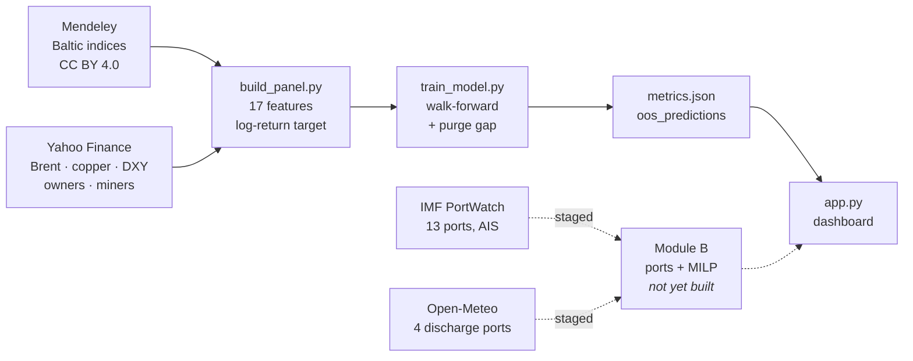

<div align="center">

# Freight Forecasting for SAIL

**Intelligent freight forecasting for optimised vessel chartering and bulk
cargo procurement from overseas to the east coast of India**

Smart India Hackathon 2026 · Problem Statement **SIH26006**
Ministry of Steel · Steel Authority of India Limited

[](https://www.python.org)
[](https://flask.palletsprojects.com)
[](https://scikit-learn.org)
[](#testing)
[](#data-sources)

</div>

---

## The problem

SAIL imports coking coal in Capesize and Panamax parcels from Australia, the
US east coast and Mozambique. Two decisions drive the landed cost:

1. **When to fix a charter.** Freight is volatile — the Capesize index ranges
   92 to 4,438 in our sample. Fixing a week early or late moves lakhs per parcel.
2. **Which vessel, into which port.** East coast draft limits are binding.
   Paradip's coal berth is 16.0 m; a laden Capesize does not fit. Haldia
   silts to 7.0–7.5 m and is served by lightering at Sagar-Sandheads, an
   anchorage in 40–50 m of water, not a berth.

This repository addresses the first decision with a validated forecasting
model, and stages the data for the second.

## The one rule

> **No number ships unless a script in this repository printed it.**

Every figure in the dashboard, in this README, and in the pitch is read from
an artefact produced by code here. Nothing is typed into the HTML. When an
artefact is missing the API returns `503` with instructions rather than
substituting a plausible-looking number.

The rule exists because the failure it prevents is easy, common, and hard to
spot on review: a headline accuracy figure that turns out to be a hard-coded
string, or a model quietly fitted on synthetic data. The test suite enforces
it rather than relying on anyone remembering.

---

## Quick start

```bash
git clone https://github.com/murthyroshan/Freight-Forecasting.git
cd Freight-Forecasting

python -m venv .venv
.venv\Scripts\activate          # Windows
pip install -r requirements.txt
```

No API keys. No accounts. Every data source is free and keyless.

```bash
python -m src.fetch_data       # 30 parquet files  (~3 min first run)
python -m src.build_panel      # 1,682 rows x 17 features
python -m tests.test_leakage   # 8 checks - run BEFORE trusting a score
python -m src.train_model      # walk-forward evaluation
python -m src.live_model       # the control experiment
python app.py                  # http://127.0.0.1:5000
```

Scripts resolve paths from `src/paths.py` rather than the working directory,
so they behave identically however you launch them.

---

## Pipeline



## Layout

| Path | Purpose |
| :--- | :--- |
| `app.py` | Flask API. Serves artefacts, computes nothing. |
| `templates/dashboard.html` | Static page; every number arrives via `fetch()`. |
| `src/paths.py` | Filesystem layout, resolved from `__file__`, not the cwd. |
| `src/fetch_data.py` | Baltic + Yahoo + PortWatch + Open-Meteo → `data/raw` |
| `src/build_panel.py` | Feature construction and the target definition. |
| `src/train_model.py` | **Module A** — Capesize direction, walk-forward. |
| `src/live_model.py` | The BDRY control experiment. |
| `tests/test_leakage.py` | Proves features cannot see the future. |
| `tests/test_app.py` | Recomputes every API claim independently. |
| `data/`, `models/` | Generated artefacts. Git-ignored. |

---

## Module A — Capesize 5-day direction

The target is the **5-business-day forward log return** of the Baltic Capesize
index, not the level. A level model scores impressively by predicting "about
the same as yesterday" and is useless for a timing decision. A forward return
also makes leakage structural rather than something we have to remember.

Capesize specifically: SAIL lifts 150–180k t coking coal parcels, which is
Capesize work.

**Expanding-window walk-forward, 8 folds, 5-day purge gap between train and test.**

| Model | RMSE | Skill vs no-change | Direction |
| :--- | ---: | ---: | ---: |
| assume no change *(baseline)* | 0.2469 | — | — |
| momentum *(1 feature, OLS)* | 0.2342 | +5.1% | 62.8% |
| **ridge** *(17 features)* | **0.2285** | **+7.5%** | **64.9%** |
| LightGBM | 0.2330 | +5.7% | 60.3% |

- Beats the no-change baseline in **6 of 8** time folds — the two losses are
  shown in the dashboard rather than hidden.
- Conformal prediction intervals achieve **80.6%** coverage against an 80% target,
  using the locally-weighted variant so bands widen in volatile regimes.
- Direction is significant at **p < 0.0001**, computed on the ~202 *independent*
  windows rather than the 1,010 overlapping rows.

**Why ridge beats LightGBM.** Daily freight autocorrelation is ~0.99 and the
targets overlap, so 1,682 rows is really ~202 effective observations. A
normal-sized gradient-boosted model memorises that instantly. The feature
count is capped at 17 for the same reason.

> **+7.5% is a small number, and it is the honest one.** Freight is close to a
> random walk. Any claim of 80–90% "accuracy" on a return series is either
> measuring the wrong thing or leaking the target.

---

## The control experiment

Our Baltic history ends 2019-07-31, because current assessments are a licensed
feed we may not redistribute. So we tested whether the free, exchange-traded
BDRY ETF — which holds Capesize, Panamax and Supramax freight futures — could
stand in for it.

| Series | What it is | Lag-1 autocorrelation | Our skill |
| :--- | :--- | ---: | ---: |
| Baltic Capesize | daily broker **survey** | **+0.624** | **+7.5%** |
| BDRY | liquid, arbitraged **ETF** | **+0.047** | **-11.2%** |

**It cannot substitute, and that is the correct result.** The Baltic index is a
survey whose panellists anchor on the previous print, so it is autocorrelated
and genuinely forecastable. BDRY is arbitraged — if its returns were
predictable at +0.62, someone would have traded that away.

Scoring well on **both** would have meant we were fooling ourselves. This is
the experiment that would have caught us, and we report it because we ran it.

**Consequence for deployment.** Production runs on SAIL's own Baltic licence
(≈£2,000/yr plus £595 setup — a rounding error at SAIL's scale). The licence
restricts *our* redistribution, not SAIL's internal use.

---

## Data sources

All free, all keyless, all verified to return real rows.

| Source | Contents | Coverage |
| :--- | :--- | :--- |
| **Mendeley** `10.17632/t76ckh2ygg` *(CC BY 4.0)* | Capesize, Panamax, Supramax, Handysize indices | **1,749 rows**, 2012-08-01 → 2019-07-31 |
| **IMF PortWatch** | daily port calls and dry bulk tonnage, 13 ports, AIS-derived | **2,797 rows each**, 2019-01-01 → 2026-08-28 |
| **Yahoo Finance** | BDRY, Brent, copper, DXY, S&P 500, USD/INR, owners, miners | 2012 → current |
| **Open-Meteo** | rainfall, wind, gusts at 4 discharge ports | **5,358 rows each** |

The Mendeley workbook is checksum-verified against a pinned SHA-256; a mismatch
aborts rather than silently training on an unexpected file.

**Ports covered.** Discharge: Paradip, Visakhapatnam, Haldia, Dhamra, Gopalpur.
Load: Hay Point, Gladstone, Newcastle, Norfolk, Baltimore, New Orleans, Beira,
Nacala.

---

## Testing

```bash
python -m tests.test_leakage    # 8 checks, no server needed
python -m tests.test_app        # 28 checks against a running server
```

`test_leakage.py` does not pattern-match on feature names. It **corrupts every
raw input after a cut date, rebuilds the panel, and requires every feature
before that date to be bit-identical** — catching any centred window, negative
shift or full-sample scaler regardless of what it is called. It also reproduces
the classic coal-price-over-freight-rate leak and confirms our forward-return
target is immune to it.

`test_app.py` does not trust the API. For every claim it serves, the answer is
**recomputed independently from the stored artefacts and compared** — a route
can return `200` and still be wrong.

---

## Status

| # | Deliverable | Status |
| :-- | :--- | :--- |
| a | Market entry timing | **Delivered** — validated, wired to the dashboard |
| b | Vessel-type optimisation under port constraints | Module B |
| c | Idle / deadhead management | Module B |
| d | Risk warnings | Module B |

**Module B is deterministic — constraints and MILP, not machine learning.**
That is forced by the data, not a shortcut: PortWatch begins 2019-01-01 and the
Baltic series ends 2019-07-31, an overlap of **211 days**. There is nowhere near
enough joint history to learn congestion effects on rates, so port and vessel
selection is solved as a cost-minimising optimisation over verified physical
constraints instead.

---

## Licence and attribution

Baltic index data is redistributed under **CC BY 4.0** from Mendeley Data
`10.17632/t76ckh2ygg`. IMF PortWatch is published by the IMF and the University
of Oxford. Baltic Exchange indices themselves are proprietary and are **not**
redistributed by this repository.
