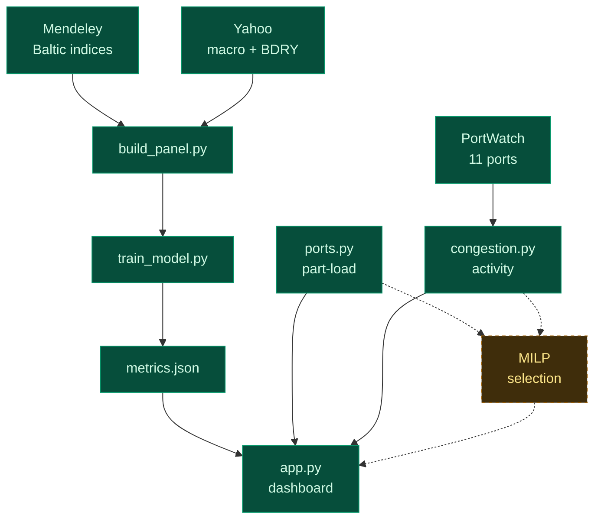

<div align="center">

# Freight Forecasting for SAIL

**Intelligent freight forecasting for optimised vessel chartering and bulk
cargo procurement from overseas to the east coast of India**

Smart India Hackathon 2026 · Problem Statement **SIH26006**
Ministry of Steel · Steel Authority of India Limited

[](https://www.python.org)
[](https://flask.palletsprojects.com)
[](https://scikit-learn.org)
[](#testing)
[](#data-sources)

</div>

---

## The problem

SAIL imports coking coal in Capesize and Panamax parcels, principally from
Australia and the US east coast. Two decisions drive the landed cost:

1. **When to fix a charter.** Freight is volatile — the Capesize index ranges
   92 to 4,438 in our sample. Fixing a week early or late moves lakhs per parcel.
2. **Which vessel, into which port.** East coast draft limits are binding.
   Paradip's coal berth is 16.0 m; a laden Capesize does not fit. Haldia
   silts to 7.0–7.5 m and is served by lightering at Sagar-Sandheads, an
   anchorage in 40–50 m of water, not a berth.

This repository addresses the first with a validated forecasting model
(**Module A**) and the second with a deterministic port and vessel model
(**Module B**) — part-load capacity, plus live berth activity at both ends of
the lane. Both are wired to the dashboard.

## The one rule

> **No number ships unless a script in this repository printed it.**

Every figure in the dashboard, in this README, and in the pitch is read from
an artefact produced by code here. Nothing is typed into the HTML. When an
artefact is missing the API returns `503` with instructions rather than
substituting a plausible-looking number.

The rule exists because the failure it prevents is easy, common, and hard to
spot on review: a headline accuracy figure that turns out to be a hard-coded
string, or a model quietly fitted on synthetic data. The test suite enforces
it rather than relying on anyone remembering.

---

## Quick start

```bash
git clone https://github.com/murthyroshan/Freight-Forecasting.git
cd Freight-Forecasting

python -m venv .venv
.venv\Scripts\activate          # Windows
pip install -r requirements.txt
```

No API keys. No accounts. Every data source is free and keyless.

```bash
python -m src.fetch_data       # 28 parquet files  (~3 min first run)
python -m src.build_panel      # 1,682 rows x 17 features
python -m src.ports            # port constraints and part-load capacity
python -m src.congestion       # live port activity, both ends
python -m tests.test_leakage   # 8 checks - run BEFORE trusting a score
python -m src.train_model      # walk-forward evaluation
python -m src.live_model       # the control experiment
python app.py                  # http://127.0.0.1:5000
```

Scripts resolve paths from `src/paths.py` rather than the working directory,
so they behave identically however you launch them.

---

## Pipeline



Solid boxes are built and tested; dashed amber is next. Two independent
chains feed the dashboard — the forecast (Module A) and the port model
(Module B) — because their data does not overlap in time.

## Layout

| Path | Purpose |
| :--- | :--- |
| `app.py` | Flask API. Serves artefacts, computes nothing. |
| `templates/dashboard.html` | Static page; every number arrives via `fetch()`. |
| `src/paths.py` | Filesystem layout, resolved from `__file__`, not the cwd. |
| `src/fetch_data.py` | Baltic + Yahoo + PortWatch + Open-Meteo → `data/raw` |
| `src/build_panel.py` | Feature construction and the target definition. |
| `src/train_model.py` | **Module A** — Capesize direction, walk-forward. |
| `src/live_model.py` | The BDRY control experiment. |
| `src/ports.py` | **Module B** — port constraints and part-load capacity. |
| `src/congestion.py` | **Module B** — live port activity from PortWatch. |
| `tests/test_leakage.py` | Proves features cannot see the future. |
| `tests/test_ports.py` | Checks part-load figures against independent properties. |
| `tests/test_congestion.py` | Checks the activity signal and its reliability guards. |
| `tests/test_app.py` | Recomputes every API claim independently. |
| `data/`, `models/` | Generated artefacts. Git-ignored. |

---

## Module A — Capesize 5-day direction

The target is the **5-business-day forward log return** of the Baltic Capesize
index, not the level. A level model scores impressively by predicting "about
the same as yesterday" and is useless for a timing decision. A forward return
also makes leakage structural rather than something we have to remember.

Capesize specifically: SAIL lifts 150–180k t coking coal parcels, which is
Capesize work.

**Expanding-window walk-forward, 8 folds, 5-day purge gap between train and test.**

| Model | RMSE | Skill vs no-change | Direction |
| :--- | ---: | ---: | ---: |
| assume no change *(baseline)* | 0.2469 | — | — |
| momentum *(1 feature, OLS)* | 0.2342 | +5.1% | 62.8% |
| **ridge** *(17 features)* | **0.2285** | **+7.5%** | **64.9%** |
| LightGBM | 0.2330 | +5.7% | 60.3% |

- Beats the no-change baseline in **6 of 8** time folds — the two losses are
  shown in the dashboard rather than hidden.
- Conformal prediction intervals achieve **80.6%** coverage against an 80% target,
  using the locally-weighted variant so bands widen in volatile regimes.
- Direction is significant at **p < 0.0001**, computed on the ~202 *independent*
  windows rather than the 1,010 overlapping rows.

**Why ridge beats LightGBM.** Daily freight autocorrelation is ~0.99 and the
targets overlap, so 1,682 rows is really ~202 effective observations. A
normal-sized gradient-boosted model memorises that instantly. The feature
count is capped at 17 for the same reason.

> **+7.5% is a small number, and it is the honest one.** Freight is close to a
> random walk. Any claim of 80–90% "accuracy" on a return series is either
> measuring the wrong thing or leaking the target.

---

## The control experiment

Our Baltic history ends 2019-07-31, because current assessments are a licensed
feed we may not redistribute. So we tested whether the free, exchange-traded
BDRY ETF — which holds Capesize, Panamax and Supramax freight futures — could
stand in for it.

| Series | What it is | Lag-1 autocorrelation | Our skill |
| :--- | :--- | ---: | ---: |
| Baltic Capesize | daily broker **survey** | **+0.624** | **+7.5%** |
| BDRY | liquid, arbitraged **ETF** | **+0.047** | **-11.2%** |

**It cannot substitute, and that is the correct result.** The Baltic index is a
survey whose panellists anchor on the previous print, so it is autocorrelated
and genuinely forecastable. BDRY is arbitraged — if its returns were
predictable at +0.62, someone would have traded that away.

Scoring well on **both** would have meant we were fooling ourselves. This is
the experiment that would have caught us, and we report it because we ran it.

**Consequence for deployment.** Production runs on SAIL's own Baltic licence
(≈£2,000/yr plus £595 setup — a rounding error at SAIL's scale). The licence
restricts *our* redistribution, not SAIL's internal use.

---

## Module B — port constraints and part-load capacity

The useful question is not *"does this ship fit into this port"* but **"how much
cargo can this ship carry into this port"**.

A laden Capesize draws 18.2 m. Paradip's coal berth permits 16.0 m. The naive
conclusion is that Capesizes cannot call Paradip. In practice they arrive
**part-laden** — you load to the draft the discharge port allows and accept a
smaller payload. The calculation uses **TPC**, tonnes per centimetre immersion,
derived from waterplane area:

| Class | DWT | Laden draft | TPC | Cargo capacity |
| :--- | ---: | ---: | ---: | ---: |
| Panamax | 82,000 | 14.4 m | 62.5 t/cm | 79,500 t |
| Capesize | 180,000 | 18.2 m | 109.9 t/cm | 176,500 t |
| Newcastlemax | 208,000 | 18.5 m | 126.8 t/cm | 204,200 t |

**Max cargo by class and destination (tonnes):**

| Class | Gangavaram | Vizag | Dhamra | Paradip | Gopalpur | Haldia |
| :--- | ---: | ---: | ---: | ---: | ---: | ---: |
| Panamax | 79,500 | 79,500 | 79,500 | 79,500 | 79,500 | 41,740 |
| Capesize | 176,500 | 175,401 | 174,302 | **152,320** | 135,834 | 68,435 |
| Newcastlemax | 204,200 | 199,129 | 197,862 | **cannot** | 153,493 | 75,815 |

So a Capesize into Paradip carries **152,320 t of a possible 176,500 t** — 86%
utilisation, leaving **24,180 t on the table** every voyage. That forgone
tonnage is the number a chartering desk trades against lighterage cost at
Sagar-Sandheads, and it is exactly what the MILP will optimise over.

Newcastlemax is rejected from Paradip outright: at 50.0 m beam against a 46.0 m
limit, no amount of part-loading makes a ship narrower.

**Validation.** The model is given Paradip's *draft* (16.0 m) and nothing about
deadweight, yet the Capesize result implies **155,820 DWT** against an
independently documented berth limit of ~155,000 DWT.

**Two honesty mechanisms.** Water density is handled properly — Haldia sits in
the brackish Hooghly, which costs a Capesize a further **0.28 m** of draft via
the Dock Water Allowance. And where a port's LOA, beam or channel limits are not
verified, the result is labelled an explicit **upper bound**: a Capesize at
Haldia computes to 68,435 t on draft alone, but it is reported as
`uneconomic` at 39% utilisation with a caveat, not as a confident berthing plan.

**In the dashboard.** The panel takes a parcel size and returns the ranked
options live, alongside the full capacity matrix colour-coded by verdict, with
the binding constraint shown on hover — Newcastlemax/Paradip reads *"beam 50.0 m
exceeds limit 46.0 m"*. Drop the parcel from 160,000 t to 75,000 t and the
recommendation switches from Capesize to Panamax, because the smallest ship that
does it in one voyage wastes the least chartered capacity. Served by
`GET /api/ports` and `POST /api/ports/options`.

---

## Module B — live port activity

**This is the only current data in the system.** The Baltic index history ends
31/07/2019; IMF PortWatch runs to **28/08/2026** across 11 ports, 2,797
consecutive daily rows each, no gaps and no nulls.

**Both ends of the lane, weighted correctly.** The five Indian berths are where
SAIL decides — it chooses the discharge port. The six Australian and US load
terminals usually arrive with the coal supply contract, so they are watched for
delay risk rather than selected, and the panel subordinates them accordingly.
Mozambique (Beira, Nacala) is excluded: a marginal trade for this lane, and both
sit below the reliability floor at 0.57 and 0.43 calls/day.

**Two tonnage figures per port, because every Indian port also loads.**
`throughput` is everything crossing the berth in both directions and is what
makes it busy; `lane` is only the direction our cargo travels. Paradip moves
**189 kt/day across its quays but only 39 kt/day inbound** — 60% of its dry bulk
leaves as iron ore, competing for the same berths, cranes and tugs as an
arriving coal parcel. Reporting only the inbound figure understates the load
five-fold.

Arrivals confirm the two are inseparable: against Paradip call counts, imports
alone correlate r = +0.620 and exports alone r = +0.751, but together they reach
**r = +0.898**. The distinction is not cosmetic at the load end either — Hay
Point and Newcastle record *zero* dry-bulk imports, so an imports-only panel
would show two of the largest coal terminals in the set as idle.

**What it is, and what it is not.** PortWatch publishes AIS-derived *arrivals
and tonnage*. It does not publish waiting time, queue length or berth
occupancy — so nothing here is called congestion. A high reading means the
berth is under load and you should expect competition for it, not that your
ship will wait a specific number of days.

Latest reading, week to 28/08/2026:

| Port | Calls/day | Normal | Percentile | Band |
| :--- | ---: | ---: | ---: | :--- |
| Visakhapatnam | 4.57 | 3.14 | 95th | **very busy** |
| Paradip | 3.57 | 2.71 | 80th | busy |
| Dhamra | 1.14 | 1.00 | 74th | busy |
| Haldia | 1.86 | 1.86 | 53rd | normal |
| Gopalpur | 0.00 | 0.29 | — | *unreliable* |

**Each port is scored against its own history**, because Visakhapatnam handles
ten times Gopalpur's traffic and a shared threshold would mark one permanently
dead and the other permanently busy.

**Bands come from the percentile, not the ratio.** Measured here, 1.32× the
median sits at the 80th percentile at Paradip but the 86th at Visakhapatnam — a
six-point spread, so one ratio threshold would call the same load "busy" at one
berth and "very busy" at another.

**Gopalpur is refused a reading.** Its baseline is 0.29 dry-bulk calls/day; a
ratio on a base that small swings by hundreds of percent when a single ship
arrives or doesn't. It is flagged `unreliable` with the reason stated, rather
than reported as a 100% collapse.

### A real seasonal pattern

Mean dry-bulk arrivals by month, where 100 is each port's own annual average:

| Port | Jan | Feb | Mar | Apr | May | Jun | Jul | Aug | Sep | Oct | Nov | Dec |
| :--- | --: | --: | --: | --: | --: | --: | --: | --: | --: | --: | --: | --: |
| Paradip | 99 | 94 | 97 | 104 | 111 | **122** | 113 | 98 | 88 | **87** | 90 | 91 |
| Visakhapatnam | 96 | 87 | 98 | 97 | 105 | **118** | 113 | 95 | 104 | 97 | 92 | 95 |
| Dhamra | 86 | 91 | 94 | 106 | 109 | **123** | 112 | 95 | 94 | 99 | 93 | 96 |
| Haldia | 108 | 103 | 102 | 93 | 100 | **110** | 107 | 88 | 100 | 94 | 96 | 99 |
| Gopalpur | 82 | 97 | 97 | 96 | 101 | **140** | 123 | 86 | 96 | 86 | 104 | 89 |

**September–December is below the rest of the year at all five ports** — tested
port by port, not just on the average, so it is not an artefact of how the mean
is taken. That window overlaps Bay of Bengal cyclone season. PortWatch reports
arrivals, not causes, so this is an association worth planning around rather
than a proven weather effect.

Served by `GET /api/congestion` and `GET /api/congestion/<port>`.

---

## Data sources

All free, all keyless, all verified to return real rows.

| Source | Contents | Coverage |
| :--- | :--- | :--- |
| **Mendeley** `10.17632/t76ckh2ygg` *(CC BY 4.0)* | Capesize, Panamax, Supramax, Handysize indices | **1,749 rows**, 2012-08-01 → 2019-07-31 |
| **IMF PortWatch** | daily port calls and dry bulk tonnage, 11 ports, AIS-derived | **2,797 rows each**, 2019-01-01 → 2026-08-28 |
| **Yahoo Finance** | BDRY, Brent, copper, DXY, S&P 500, USD/INR, owners, miners | 2012 → current |
| **Open-Meteo** | rainfall, wind, gusts at 4 discharge ports | **5,358 rows each** |

The Mendeley workbook is checksum-verified against a pinned SHA-256; a mismatch
aborts rather than silently training on an unexpected file.

**Ports covered.** Discharge (where SAIL decides): Paradip, Visakhapatnam,
Haldia, Dhamra, Gopalpur. Load (watched for delay risk — the coal supply
contract picks the terminal, not SAIL): Hay Point, Gladstone, Newcastle,
Norfolk, Baltimore, New Orleans.

---

## Testing

```bash
python -m tests.test_leakage    # 8 checks, no server needed
python -m tests.test_ports      # 34 checks, no server needed
python -m tests.test_congestion # 44 checks, no server needed
python -m tests.test_app        # 70 checks against a running server
```

`test_leakage.py` does not pattern-match on feature names. It **corrupts every
raw input after a cut date, rebuilds the panel, and requires every feature
before that date to be bit-identical** — catching any centred window, negative
shift or full-sample scaler regardless of what it is called. It also reproduces
the classic coal-price-over-freight-rate leak and confirms our forward-return
target is immune to it.

`test_ports.py` does not re-run the port model's own arithmetic back at it. It
checks **independent properties**: that the resulting sailing draft respects the
port limit for all 41 loadable combinations, that a deeper port never carries
less than a shallower one, and that the implied deadweight matches a figure the
model was never given.

`test_app.py` does not trust the API. For every claim it serves, the answer is
**recomputed independently from the stored artefacts and compared** — a route
can return `200` and still be wrong.

---

## Status

| # | Deliverable | Status |
| :-- | :--- | :--- |
| a | Market entry timing | **Delivered** — validated, wired to the dashboard |
| b | Vessel-type optimisation under port constraints | **Part-load capacity delivered**; MILP selection next |
| c | Idle / deadhead management | **Port load signal delivered**; dwell time next |
| d | Risk warnings | **Seasonal pattern delivered**; alerting next |

**Module B is deterministic — constraints and MILP, not machine learning.**
That is forced by the data, not a shortcut: PortWatch begins 2019-01-01 and the
Baltic series ends 2019-07-31, an overlap of **211 days**. There is nowhere near
enough joint history to learn congestion effects on rates, so port and vessel
selection is solved as a cost-minimising optimisation over verified physical
constraints instead.

---

## Licence and attribution

Baltic index data is redistributed under **CC BY 4.0** from Mendeley Data
`10.17632/t76ckh2ygg`. IMF PortWatch is published by the IMF and the University
of Oxford. Baltic Exchange indices themselves are proprietary and are **not**
redistributed by this repository.
