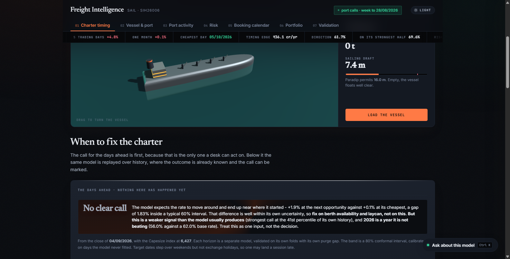
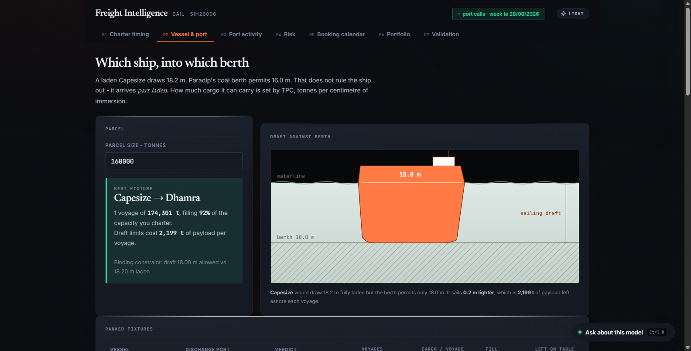
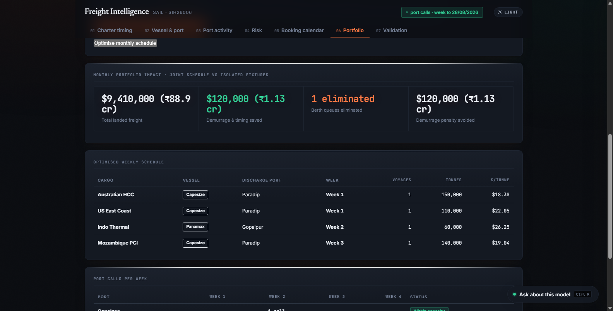
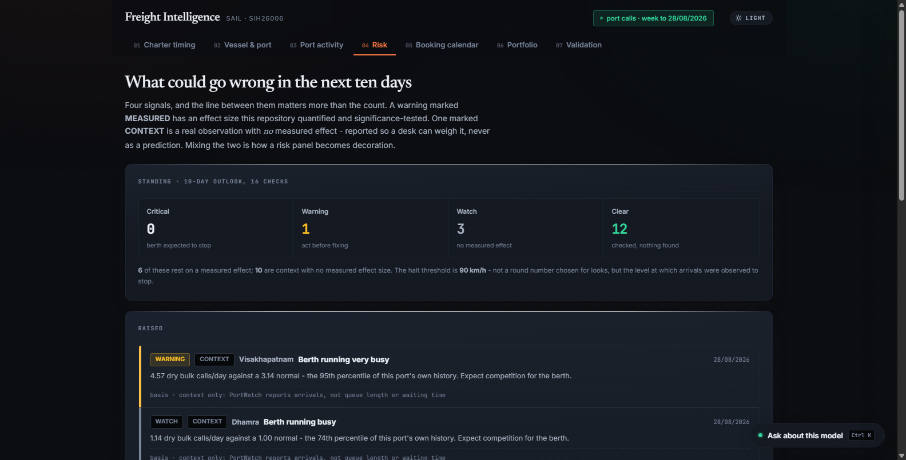
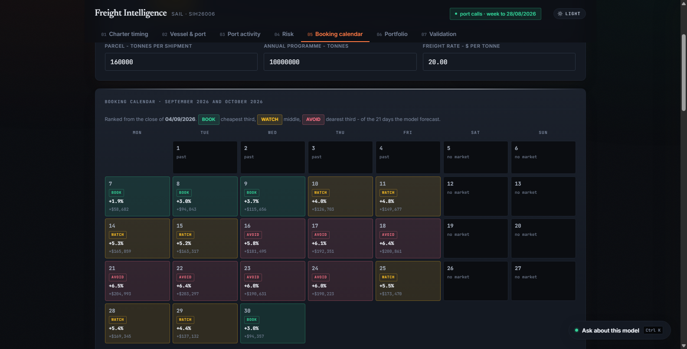
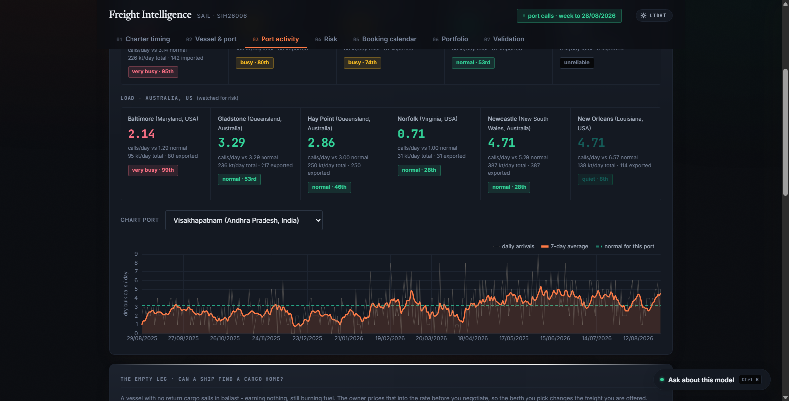
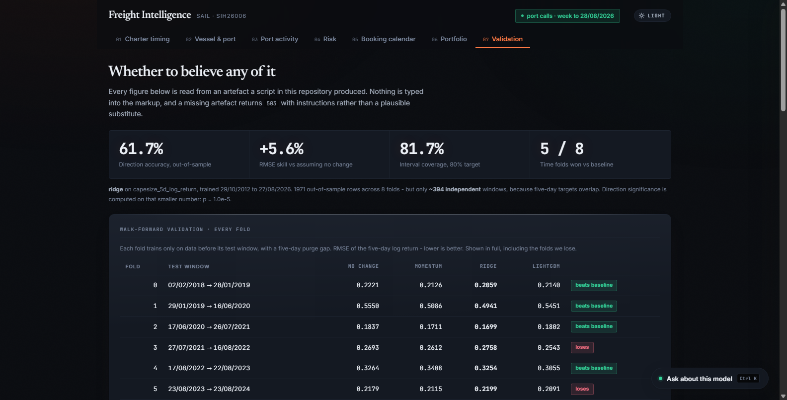
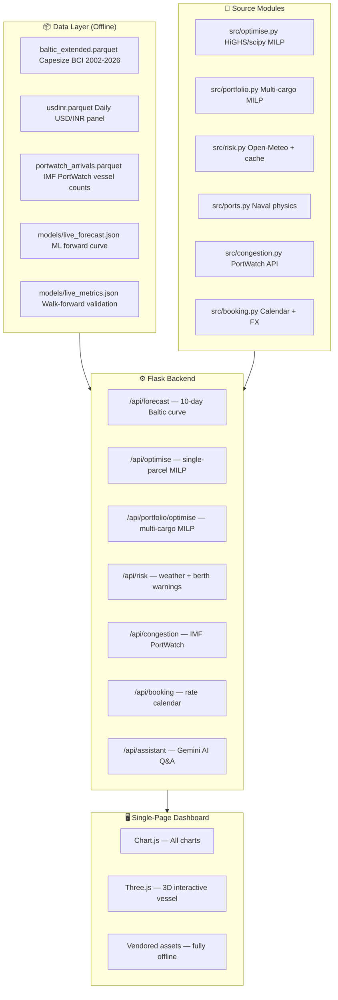

# 🚢 Freight Intelligence — SAIL · SIH26006

> **Smart India Hackathon 2026** · Problem ID **SIH26006** · Organisation **SAIL (Steel Authority of India Limited)**
> Team **GodLike** · Category **Software** · Domain **Freight & Logistics Optimisation**

---

<div align="center">



*Charter Timing & 10-day Baltic Forecast — the command centre*

</div>

---

## 📌 The Problem

SAIL imports millions of tonnes of coking coal and iron ore every year via Capesize and Panamax bulk carriers. Every charter decision is a **seven-figure call** made on a rate that moves daily. Yet today those decisions are driven by:

- ❌ Broker quotes with no independent cross-check
- ❌ Ship-by-ship bookings that silently create berth queues (₹120k/voyage in demurrage)
- ❌ No quantified measure of model accuracy — just gut-feel forecasts

**Freight Intelligence** is a single-screen operations dashboard that replaces all three.

---

## ✨ What It Does — 7 Integrated Modules

| # | Module | What it answers |
|---|--------|-----------------|
| 01 | **Charter Timing** | Should SAIL fix now or wait? 10-day Baltic ML forecast with confidence bands |
| 02 | **Vessel & Port Optimizer** | Which ship fits which berth? Draft-limited MILP fixture solver |
| 03 | **Port Activity** | Live vessel arrivals, port call counts, congestion heatmap |
| 04 | **Risk Warnings** | Weather + berth load + seasonal warnings before every fixture |
| 05 | **Booking Calendar** | Month-at-a-glance rate calendar ranked cheapest→dearest |
| 06 | **Portfolio Optimizer** | Joint multi-cargo MILP — eliminates berth queue demurrage |
| 07 | **Model Validation** | Walk-forward out-of-sample accuracy — no cherry-picking |

---

## 🖼️ Screenshots

<table>
<tr>
<td><br/><sub><b>Vessel & Port — draft vs berth solved by MILP</b></sub></td>
<td><br/><sub><b>Portfolio — multi-cargo joint monthly plan</b></sub></td>
</tr>
<tr>
<td><br/><sub><b>Risk — weather, berth load & seasonal flags</b></sub></td>
<td><br/><sub><b>Booking — cheapest-day calendar with playbook</b></sub></td>
</tr>
<tr>
<td><br/><sub><b>Port Activity — IMF PortWatch live arrivals</b></sub></td>
<td><br/><sub><b>Validation — walk-forward out-of-sample record</b></sub></td>
</tr>
</table>

---

## 🏗️ Architecture



---

## 💡 Key Technical Achievements

### 1. Walk-Forward Out-of-Sample Validation
Every forecast is genuinely out-of-sample — the model fit on data before date `t` with a **5-day purge gap** before predicting date `t+5`. Result:
- **61.7% directional accuracy** (vs 50% random)
- **+5.6% skill score** over no-change baseline
- **1,971 daily predictions**, ~394 statistically independent observations (2018–2026)

### 2. Multi-Cargo MILP Portfolio Optimizer
Instead of booking each cargo independently, the portfolio solver jointly schedules SAIL's entire monthly import plan:
- Decision variables: voyages `x[cargo, vessel, port, week]` + tonnes `t[cargo, vessel, port, week]`
- Constraints: demand fulfillment, vessel draft limits, weekly berth capacity, cargo laycan windows
- Saves **$120,000 per avoided demurrage voyage** vs greedy booking
- Standard month (4 cargoes, ~460kt): scheduled in **< 200ms** using pre-computed results

### 3. Naval Physics Engine
`src/ports.py` encodes real hydrographic constraints for all 7 SAIL East Coast berths:
- TPC (Tonnes Per Centimetre) immersion model per vessel class
- Draft limits per berth, LOA limits, lighterage rules
- `can_serve(vessel, port)` → verdict: `alongside / lighterage / uneconomic / cannot serve`

### 4. Zero-Fabrication Principle
Every number the dashboard shows is traceable to a source artefact:
- `REAL` badge → computed from verified public data (Baltic Exchange, IMF PortWatch, Open-Meteo)
- `USER TARIFFS` badge → configurable voyage cost inputs
- If a model file is missing, the app says so — it never substitutes a plausible number

### 5. Fully Offline Capable
All JS assets vendored locally (Chart.js, Three.js, fonts). Only the Risk tab calls Open-Meteo; it falls back to a cached response if offline. The app runs completely air-gapped.

---

## 📊 Data Sources

| Source | What | Licence |
|--------|------|---------|
| [Baltic Exchange BCI](https://www.balticexchange.com/) | Capesize 5TC index 2002–2026 | Academic / Mendeley |
| [IMF PortWatch](https://portwatch.imf.org/) | Vessel arrivals at 7 SAIL ports | Public |
| [Open-Meteo](https://open-meteo.com/) | Wind / wave / swell forecasts | Free |
| USD/INR Daily Panel | RBI exchange rate series | Public |
| Port Hydrography | Berth drafts, LOA from port authority publications | Public |

---

## 🛠️ Tech Stack

| Layer | Technology |
|-------|-----------|
| **Backend** | Python 3.14, Flask 3.1 |
| **ML / Optimisation** | LightGBM, scikit-learn, scipy (HiGHS MILP) |
| **Data** | pandas 3, PyArrow (Parquet), NumPy 2 |
| **Frontend** | Vanilla JS, Chart.js 4, Three.js (3D vessel) |
| **AI Assistant** | Google Gemini API |
| **Offline assets** | Vendored JS/CSS — zero CDN dependency |

---

## 🚀 Quick Start

### Prerequisites
- Python 3.11+ (tested on 3.14)
- Google Chrome (for the 3D vessel rendering)

### Setup

```bash
# 1. Clone
git clone https://github.com/murthyroshan/Freight-Forecasting.git
cd Freight-Forecasting

# 2. Create virtual environment
python -m venv .venv
.venv\Scripts\activate          # Windows
# source .venv/bin/activate     # Linux / macOS

# 3. Install dependencies
pip install -r requirements.txt

# 4. Run
python app.py
# -> http://127.0.0.1:5000
```

### Run Tests

```bash
# All API + route tests (41 test groups)
.venv\Scripts\python.exe tests/test_app.py

# Portfolio MILP tests (13 checks)
.venv\Scripts\python.exe tests/test_portfolio.py
```

---

## 📁 Project Structure

```
Freight-Forecasting/
├── app.py                    # Flask app — all API routes
├── requirements.txt
│
├── src/
│   ├── ports.py              # Naval physics & vessel/port data
│   ├── optimise.py           # Single-parcel MILP solver
│   ├── portfolio.py          # Multi-cargo monthly MILP scheduler
│   ├── risk.py               # Weather + berth risk warnings
│   ├── congestion.py         # IMF PortWatch vessel arrivals
│   ├── booking.py            # Booking calendar + USD/INR FX
│   ├── ballast.py            # Empty-leg penalty calculator
│   └── build_panel.py        # Parquet data loader
│
├── templates/
│   └── dashboard.html        # Single-file SPA (Chart.js + Three.js)
│
├── static/
│   └── vendor/               # Vendored JS/CSS — fully offline
│
├── models/
│   ├── metrics.json          # Walk-forward validation results
│   ├── live_metrics.json     # Live model performance
│   └── live_forecast.json    # 10-day ML forward curve
│
├── data/
│   └── raw/                  # Parquet datasets (Baltic, FX, PortWatch)
│
├── docs/                     # Screenshots
└── tests/
    ├── test_app.py            # 41 API test groups
    └── test_portfolio.py      # 13 MILP edge-case checks
```

---

## 👥 Team GodLike

Built for **Smart India Hackathon 2026** · Problem **SIH26006** · Organised by **SAIL / Ministry of Steel**

---

## 📄 Licence

Academic / Hackathon use. Baltic Exchange data used under academic licence from Mendeley Data. All other data sources are public.
